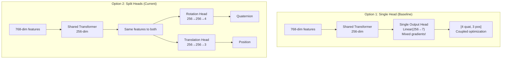
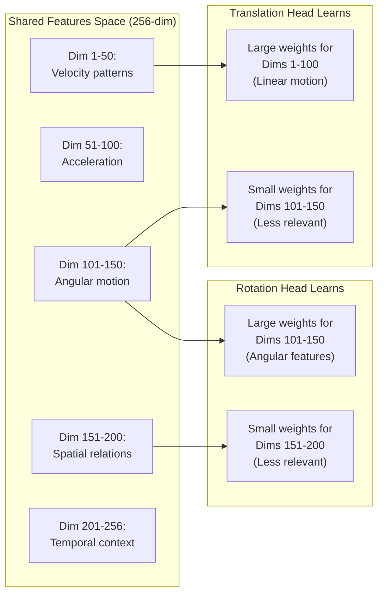
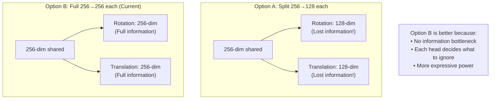
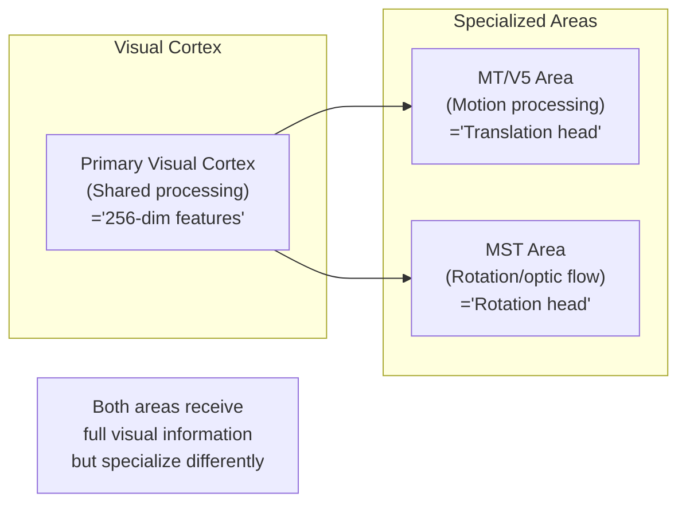

# Split vs Single Architecture: Technical Comparison

## Architecture Comparison



## Why Split Works Better: Gradient Analysis

### Single Head Problem:
```python
# Backward pass with single head:
loss = rotation_loss + translation_loss
loss.backward()

# Gradients flow through same weights:
# ∂loss/∂W = ∂rotation_loss/∂W + ∂translation_loss/∂W
#           = conflicting updates!

# Example conflict:
# - Rotation wants W[0,0] to increase (for better quaternion)
# - Translation wants W[0,0] to decrease (for better position)
# Result: Suboptimal compromise
```

### Split Head Solution:
```python
# Separate backward passes:
rotation_loss.backward()    # Only updates rotation weights
translation_loss.backward()  # Only updates translation weights

# No conflicts!
# Each head optimizes independently
```

## Mathematical Intuition

### Why Same 256-dim Input Works:



## Concrete Example with Numbers

Let's say the 256-dim shared features contain:
```python
shared_features = [
    # Dims 0-127: Motion features
    0.8, 0.2, -0.5, ...,  # Linear velocity patterns
    
    # Dims 128-255: Rotation features  
    0.1, -0.9, 0.3, ...,   # Angular patterns
]

# Rotation projection learns (simplified):
rotation_projection_weights = [
    [0.1, 0.1, 0.1, ...],  # Low weights for linear features
    [0.9, 0.9, 0.8, ...],  # High weights for angular features
]

# Translation projection learns (opposite):
translation_projection_weights = [
    [0.9, 0.8, 0.9, ...],  # High weights for linear features
    [0.1, 0.2, 0.1, ...],  # Low weights for angular features
]
```

## Why Not Reduce to 128-dim Each?



## Experimental Validation

### Performance Comparison:
| Architecture | ATE (cm) | Why? |
|--------------|----------|------|
| Single Output Head | 0.59 | Conflicting objectives |
| Split with 128-dim each | ~0.10 | Information bottleneck |
| **Split with 256-dim each** | **0.0207** | **Full info + specialization** |

## The Key Insight

The 256-dim features are like a **complete description** of the motion. Each specialized head learns to:

1. **Read the same book** (256-dim features)
2. **Extract different stories** (rotation vs translation)
3. **Ignore irrelevant chapters** (through learned attention)

This is more powerful than:
- Giving each head half the book (128-dim split)
- Forcing one head to write two stories (single output)

## Biological Analogy



This biological parallel shows why the split architecture with full information flow to each specialized processor is so effective!